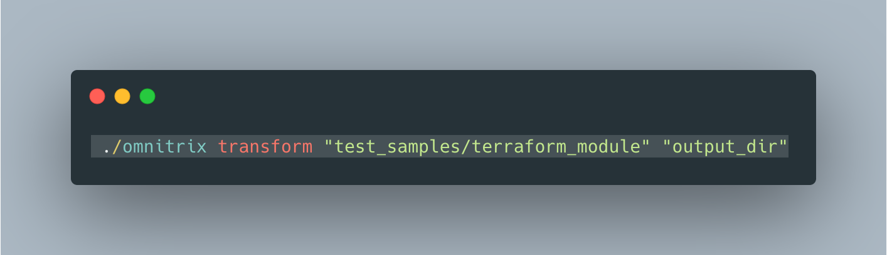

<h1 align=center>
    Omnitrix ⌚
    <br>
        
    <br>
</h1>

## About:
Omnitrix is a transformer of templatized DNA samples to actual projects(Aliens).

## Pros:
- Binary - Omnitrix is self contained binary without any dependencies unlike some other tools which require installations of various tool or languages.
- Golang Templates - Omnitrix is powered by [golang templates](https://golang.org/pkg/text/template/) and [Sprig](http://masterminds.github.io/sprig/) functions.
- Super fast - Thanks to golang.

## Usage:


Output:
```bash
./omnitrix transform "test_samples/terraform_module" "output_dir"

Scanning the DNASample sample provided : test_samples/terraform_module
Parsing Path:  test_samples/terraform_module
Parsing Path:  test_samples/terraform_module/.gitignore
Parsing Path:  test_samples/terraform_module/LICENSE
Parsing Path:  test_samples/terraform_module/README.md
Parsing Path:  test_samples/terraform_module/examples
Parsing Path:  test_samples/terraform_module/main.tf
Parsing Path:  test_samples/terraform_module/omnitrix.json
Parsing Path:  test_samples/terraform_module/out.tf
Parsing Path:  test_samples/terraform_module/test
Parsing Path:  test_samples/terraform_module/vars.tf
Parsing Path:  test_samples/terraform_module/versions.tf
```

## Inspiration
[cookiecutter](https://github.com/cookiecutter/cookiecutter) A command-line utility that creates projects from cookiecutters (project templates), e.g. Python package projects, VueJS projects.
